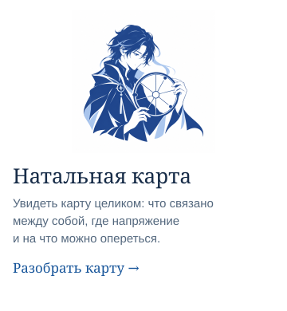
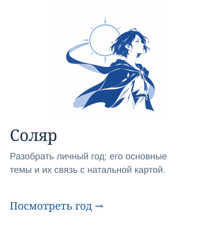
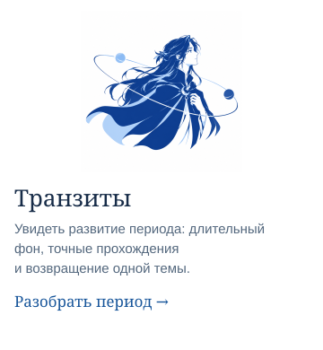
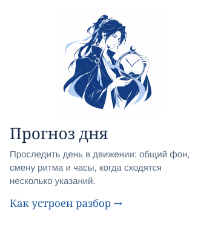
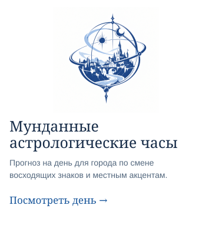

# Astrolab

Астрология для работы с ИИ. Astrolab рассчитывает карту, соляр и транзиты —
ты с агентом разбираешь, что они могут значить для тебя.

[Создать STARS](docs/stars/README.md) · [Выбрать разбор](#разборы) ·
[Подключить расчёты](#запуск-в-docker) · [API](docs/mcp-api.md)

## STARS.md — ИИ, который лучше понимает тебя


STARS.md помогает ИИ лучше понимать тебя и учитывать это в совместной работе:
какие вопросы задавать, что предлагать и как объяснять.

Всё, что ты разберёшь с агентом, сохраняется. К этому можно возвращаться, дополнять
и пересматривать — чтобы взаимопонимание развивалось по мере общения.

**[Сделать свой STARS →](docs/stars/README.md)** · [Посмотреть пример](docs/stars/EXAMPLE.md)

Начать можно без установки расчётного сервера.

## Разборы

Выбери тему и передай поручение своему агенту.

<p>
<a href="docs/recipes.md#natal"></a>
<a href="docs/recipes.md#solar"></a>
</p>
<p>
<a href="docs/recipes.md#transits"></a>
<a href="docs/recipes.md#day"></a>
</p>
<p>
<a href="docs/recipes.md#city-day"></a>
</p>

Знаешь астрологию глубже? Собирай свои разборы из [расчётов API](docs/mcp-api.md).
Astrolab возвращает структурированные данные и не ограничивает тебя этими рецептами.
Астрологические толкования — не установленные факты и не гарантии событий.

## Доступные инструменты

- `rising_hands` — двенадцать интервалов восходящих знаков для заданной даты и места;
- `natal` — положения, дома, углы, аспекты, достоинства, секта, размещения и Парс Фортуны;
- `profection` — годовая профекция и управитель года;
- `solar_return` — точный момент соляра и его связи с натальной картой;
- `transits` — точные транзитные события и объединённые окна прохождений.

Дата и время передаются через API в UTC и формате ISO 8601, если инструмент явно
не запрашивает смещение для отображения. Долготы задаются в эклиптических градусах
диапазона `[0, 360)`.

## Запуск в Docker

Самый короткий поддерживаемый путь — Docker. При сборке образ загружает закреплённые
файлы Swiss Ephemeris и проверяет их хеши SHA-256.

```powershell
docker build -t astrolab .
docker run --rm --name astrolab -p 127.0.0.1:8400:8400 astrolab
```

Адрес MCP-сервера: `http://127.0.0.1:8400/mcp`. В другом терминале:

```powershell
uv sync --frozen
uv run python examples/call_mcp.py --url http://127.0.0.1:8400/mcp
```

Пример поддерживает `rising_hands`, `natal`, `chart_workflow` и `invalid_input`;
описание вызовов находится в документации MCP ниже.

Эта команда открывает Astrolab только на локальной машине. В сервере нет аутентификации
и TLS: не публикуй его порт в локальной сети или интернете. Для удалённого развёртывания
нужен отдельный TLS-вход с аутентификацией и контролем доступа.

## Запуск из исходников

Требования: Python 3.13, [uv](https://docs.astral.sh/uv/) и PowerShell 7.

```powershell
uv sync --frozen --group engine-a
pwsh infra/ephe/get-ephe.ps1 -Source web

$env:SWISS_ENGINE = "a"
$env:SWISS_EPHE_PATH = (Resolve-Path "infra/ephe/files").Path
$env:ASTRO_MCP_TRANSPORT = "http"
$env:ASTRO_MCP_HOST = "127.0.0.1"
uv run python -m astro.server
```

Сервер не запустит Engine A, если необходимые файлы эфемерид отсутствуют или неполны.

## Проверка копии репозитория

```powershell
python tools/check_public_surface.py
uv sync --frozen --group engine-a
pwsh infra/ephe/get-ephe.ps1 -Source web

$env:SWISS_ENGINE = "a"
$env:SWISS_EPHE_PATH = (Resolve-Path "infra/ephe/files").Path
$env:REQUIRE_ENGINE_A = "1"
uv run pytest -m "not needs_swiss_mcp" -q
```

Четырём сравнительным тестам `needs_swiss_mcp` дополнительно нужен эталонный сервис
по адресу `http://localhost:8000/mcp`. Для работы публичного Docker-образа они не нужны.

## Документация

- [Инструменты MCP](docs/mcp-api.md)
- [Расчётные движки](docs/engines.md)
- [Контракт результата](docs/output-contract.md)

## Лицензия

Частное некоммерческое ознакомление разрешено в течение 30 дней. Для производственного
и коммерческого использования нужно письменное лицензионное соглашение. Условия — в
[LICENSE](LICENSE).
