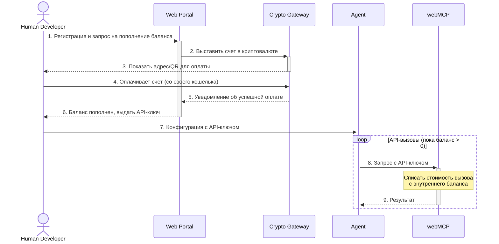
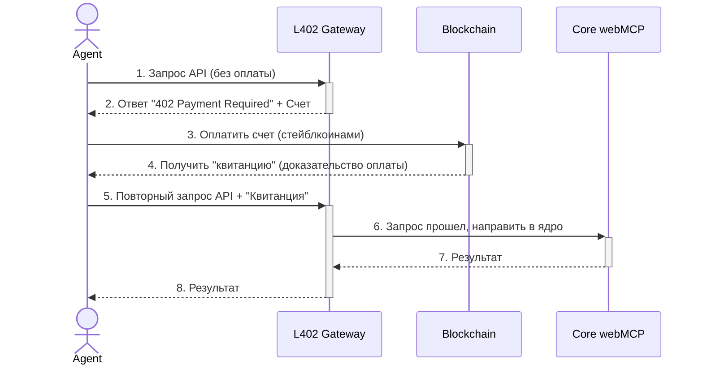

# Видение проекта: CATMEastrolab

Этот документ фиксирует ключевые смыслы и стратегическое видение проекта.

## 1. Проблема: Монолитный мир

Существующий астрологический софт — это закрытые, монолитные программы, созданные в парадигме "человек-компьютер". Они не предназначены для мира, где сервисы и AI-агенты общаются друг с другом автоматически.

## 2. Наш Подход: Фабрика Функций

Мы не создаем еще один "продукт" или "софт". Мы строим **"фабрику функций"** — сложный "мэшап" из лучших инструментов, который способен выполнять дискретные, атомарные задачи (рассчитать натал, построить транзит, отрендерить карту).

Наша ценность — не в интерфейсе, а в абстрагировании сложности. Мы берем на себя всю грязную работу по оркестрации, проверке данных и получению чистого, надежного результата.

## 3. Продукт: webMCP

Наш продукт — это идеологический аналог **webMCP**. Это headless-сервис (без интерфейса), который предоставляет доступ к функциям нашей "фабрики" через веб-API.

Он не предназначен для людей-пользователей. Он предназначен для программ.

## 4. Бизнес-модель: aA2A Commerce (Automated Agent-to-Agent)

Мы работаем в парадигме **aA2A-коммерции**.

- **Мы продаем:** Результат работы функции (JSON, SVG-файл).
- **Кому мы продаем:** Другим программам, скриптам, AI-агентам.

Мы продаем **"агентную автоматизацию" другим агентам**. Наш `webMCP` — это **экспертный сервис** по астрологии, который предоставляет свою функциональность (экспертизу) другим автоматизированным системам.

## 5. Этапы Реализации

### Этап 1: Централизованный webMCP (Прагматичный)

На этом этапе мы создаем API-сервис, где владелец агента (человек) регистрируется, получает API-ключ и пополняет внутренний баланс своего аккаунта. Так как мы не находимся в юрисдикции традиционных платежных систем, пополнение происходит с помощью криптовалюты (например, через самохостируемый шлюз **BTCPay Server**, который не зависит от юрисдикций). Биллинг работает по модели списания средств с этого внутреннего баланса за каждый API-вызов.

### Этап 2: Децентрализованный webMCP (Визионерский)

Полностью автоматизированная система без участия человека.
- **Идентичность:** Криптокошелек
- **Платежи:** Криптовалюта (стейблкойны)
- **Контракт и доверие:** Смарт-контракт или специализированный протокол.

Для технической реализации этой модели наиболее перспективным выглядит протокол **L402** (HTTP 402 Payment Required). Он стандартизирует процесс, при котором API-шлюз может запросить оплату за вызов, а агент-клиент может автоматически ее произвести и получить доступ. Это готовый шаблон для aA2A-коммерции.

Это позволяет агентам находить друг друга, договариваться об услуге и проводить оплату полностью автономно и без доверия к центральной стороне. Это конечная цель нашего видения.

## 6. Архитектурные схемы

### Этап 1: Схема централизованной модели (с крипто-балансом)

### Этап 2: Схема децентрализованной модели (L402)

