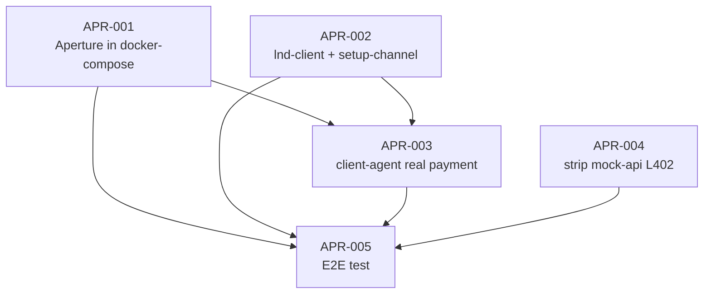

# BACKLOG — L402 Proof of Vision

**Project:** aA2A Commerce Smoke Test
**Updated:** 2026-03-06

## Legend
- Status: `TODO` `IN_PROGRESS` `DONE` `BLOCKED`
- Priority: `P0` `P1`
- Cynefin: `Clear` `Complicated`

---

## Phase 1: Dummy L402 Flow (DONE)

| Status | ID | Priority | Cynefin | Task |
|---|---|---|---|---|
| DONE | L402-MVP-001 | P0 | Clear | Initialize project structure and artifacts |
| DONE | L402-MVP-002 | P0 | Complicated | Implement and containerize mock-api service |
| DONE | L402-MVP-003 | P1 | Complicated | Implement Dummy L402 Logic in Mock-API |
| DONE | L402-MVP-004 | P1 | Complicated | Implement and containerize client-agent |
| DONE | L402-MVP-FINAL | P0 | Clear | Proof of Vision successfully implemented by agent `Claude` |

Phase 1 proved the concept with dummy tokens. Real LND integration (006/008) was done but exposed the need for a proper L402 proxy.

---

## Phase 2: Aperture Integration (real Lightning payment)

| Status | ID | Priority | Cynefin | Task |
|---|---|---|---|---|
| TODO | L402-APR-001 | P0 | Complicated | Integrate Aperture as L402 reverse proxy |
| TODO | L402-APR-002 | P0 | Complicated | Add lnd-client + setup-channel script |
| TODO | L402-APR-003 | P1 | Complicated | Adapt client-agent for real Lightning payment |
| TODO | L402-APR-004 | P1 | Clear | Strip L402 logic from mock-api (pure backend) |
| TODO | L402-APR-005 | P1 | Complicated | End-to-end real Lightning payment test |

### Phase 2 Dependency Graph (DAG)

### Parallelism

Can run in parallel:
- `APR-001` (Aperture) + `APR-002` (lnd-client) + `APR-004` (strip mock-api)

Sequential:
- `APR-003` waits for APR-001 + APR-002
- `APR-005` waits for ALL

### Key decisions

- **Server-side L402:** Aperture (Lightning Labs, `lightninglabs/aperture:v0.3-beta`)
- **Client-side L402:** Direct LND gRPC or refined-element MCP (decide at APR-003)
- **Research:** `tasks/research_log_lightning_mcp_ecosystem_20260306.md`

---

## Phase 1 legacy tasks (archived)

| Status | ID | Task | Note |
|---|---|---|---|
| DONE | L402-MVP-006 | Integrate Real Lightning Node (LND) | Solved rpcbind + tlsextradomain |
| DONE | L402-MVP-008 | Implement LND with Healthchecks | Solved with docker healthcheck |
| SUPERSEDED | L402-MVP-007 | Adapt client-agent for Real LND | Replaced by APR-003 (Aperture approach) |
| SUPERSEDED | L402-MVP-005 | Integrate services and document E2E | Replaced by APR-005 |
